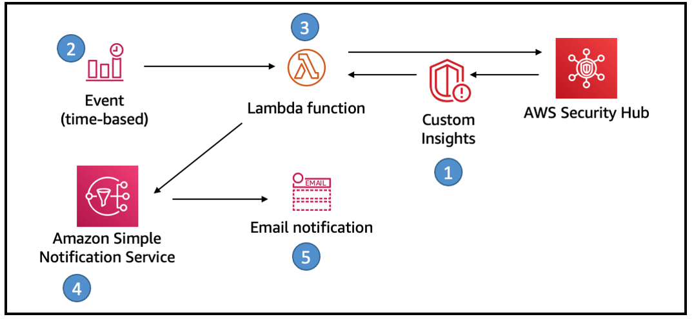

## Recurring Security Hub Summary Email

This solution uses Security Hub custom insights, AWS Lambda, and the Security Hub API. 
A custom insight is a collection of findings that are aggregated by a grouping attribute, such as severity or status. 
Insights help you identify common security issues that may require remediation action. 
Security Hub includes several managed insights, or you can create your own custom insights.

### Overview
A recurring Security Hub Summary email will provide recipients with a proactive communication summarizing the security posture and improvement within their AWS Accounts.  
The email message contains the following sections:

- AWS Foundational Security Best Practices findings by status
- AWS Foundational Security Best Practices findings by severity
- Amazon GuardDuty findings by severity
- AWS IAM Access Analyzer findings by severity
- Unresolved findings by severity
- New findings in the last 7 days by security product
- Top 10 resource types with the most findings

### Here’s how the solution works
1.	Seven Security Hub custom insights are created (via Terraform)
2.	A CloudWatch time-based event invokes a Lambda function for processing.
3.	The Lambda function gets results of the custom insights from Security Hub, formats the results for email and sends a message to SNS.
4.	You can then manually add the email address to the SNS topic to receive the email notifications.



### Local development and Test

Thanks to `cargo lambda` developing and testing lambda functions written in Rust is really easy!

```shell
git clone <this_repo>
cd <this_repo>

# Assuming you have the Rust toolchain (rustup) and cargo-lambda installed

cargo lambda watch # start a local emulator and runs the lambda function
cargo lambda invoke / # Command 
  sechub_summary / # Function name
  --data-ascii "{ \"id\": \"hi\", \"region\": \"hi\" }" / # Data to pass to the function 
  -p sso-bls-prd # AWS Profile to use  
```


### Deployment Steps

__Step 1:__ Define Custom Insights, SNS Topic, and IAM Policies in Terraform

- Custom Insights: Create the necessary Security Hub custom insights.
- SNS Topic: Create an SNS topic.
- IAM Policies and Roles: Create IAM policies and roles for the Lambda function.
- Scheduler: Set up the CloudWatch event to trigger the Lambda function.

__Step 2:__ Deploy the Lambda Function Using [cargo lambda](https://www.cargo-lambda.info/)

see [cargo lambda build](https://www.cargo-lambda.info/commands/build.html) and [cargo lambda deploy](https://www.cargo-lambda.info/commands/deploy.html)
commands documentation.

The build process will create a zip file that contains the Lambda function code and its dependencies.

__Step 3:__ Update Terraform to Use the Lambda ARN

Add the following resources:

- Lambda function
- Lambda permission
- CloudWatch event rule

<small>Based on [AWS Security Hub Daily Summary Email](https://aws.amazon.com/blogs/security/how-to-set-up-a-recurring-security-hub-summary-email/)</small>
